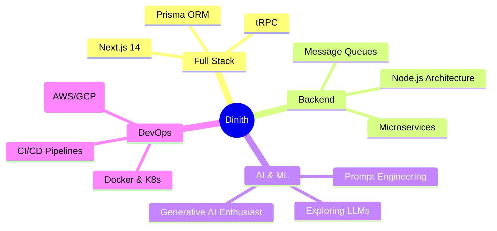

<div align="center">

<!-- Animated Banner -->


<!-- Typing Animation -->


<br/>

<!-- Status Badges -->
<p>
  
  &nbsp;
  
  &nbsp;
  
</p>

<br/>

</div>

---

## `$ whoami`

```typescript
const dinith = {
  name        : "Dinith Ankitha",
  role        : "Undergraduate Software Engineer @ University of Kelaniya",
  location    : "Sri Lanka 🇱🇰",
  focus       : [
    "Full Stack Web Development",
    "Backend Systems & REST APIs",
    "Real-Time Multiplayer Applications",
    "Generative AI Enthusiast 🤖",
  ],
  currentlyLearning : [
    "Node.js Advanced Architecture",
    "System Design Principles",
    "Cloud & DevOps Basics",
  ],
  goal        : "Build scalable, impactful systems — at the intersection of full stack & AI.",
  openTo      : "Internships, collabs, and interesting problems 🚀",
};
```

---

## 🛠️ Tech Stack

<div align="center">

### 🌐 Frontend
<p>
  
</p>

### ⚙️ Backend & APIs
<p>
  
</p>

### 🗄️ Databases & Storage
<p>
  
</p>

### ☁️ DevOps & Tools
<p>
  
</p>

</div>

---

## 📊 GitHub Stats

<div align="center">
  
  
</div>

<div align="center">
  
</div>

---

## 🏆 GitHub Trophies

<div align="center">
  
</div>

---

## 📈 Contribution Activity

<div align="center">
  
</div>

---

## 🎮 Featured Project — Browser Game

<div align="center">

<a href="https://game-lac-theta.vercel.app/">
  
</a>

</div>

<br/>

```js
const project = {
  name    : "Browser Play Game 🎮",
  type    : "Vanilla JS + Node.js Game",
  liveAt  : "https://game-lac-theta.vercel.app/",
  stack   : ["Vanilla JavaScript", "Node.js", "HTML5", "CSS3"],
  status  : "✅ Live & Playable in Your Browser",
};
```

> Built from scratch with **zero frameworks** — pure **Vanilla JavaScript** on the frontend and **Node.js** on the backend. No installs, no setup. Just open the link and play. 🕹️

---

## 🚀 What I'm Building

| 🔨 Project | 🧠 Description | 🛠 Stack | 🚦 Status |
|---|---|---|---|
| **🍽️ Restaurant Management System** | Full-featured MERN stack app for restaurant operations — menus, orders & reservations | MongoDB, Express, React, Node.js | 🟡 In Progress |
| **📦 Inventory Management System** | Full stack system to track stock, suppliers & transactions with a clean dashboard UI | React, Node.js, MySQL | 🟡 In Progress |

---

## 🌱 Currently Exploring

<div align="center">



</div>

---

## 🤝 Connect With Me

<div align="center">

<br/>

<a href="https://www.linkedin.com/in/dinith-pamunuwatte-664770290/">
  
</a>
&nbsp;&nbsp;
<a href="mailto:dinithchamo@gmail.com">
  
</a>

<br/><br/>

<a href="https://x.com/DNith4">
  
</a>
&nbsp;&nbsp;
<a href="https://hidinith.netlify.app/">
  
</a>

<br/><br/>

---

<br/>

> ### *" Code is not just syntax — it's a craft. Build things that matter. "*

<br/>

<!-- Snake animation -->
<picture>
  <source media="(prefers-color-scheme: dark)" srcset="https://raw.githubusercontent.com/platane/snk/output/github-contribution-grid-snake-dark.svg"/>
  <source media="(prefers-color-scheme: light)" srcset="https://raw.githubusercontent.com/platane/snk/output/github-contribution-grid-snake.svg"/>
  
</picture>

<br/>

<!-- Profile views -->

&nbsp;


<br/><br/>

<!-- Footer wave -->


</div>
